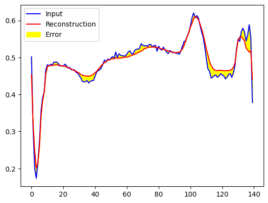
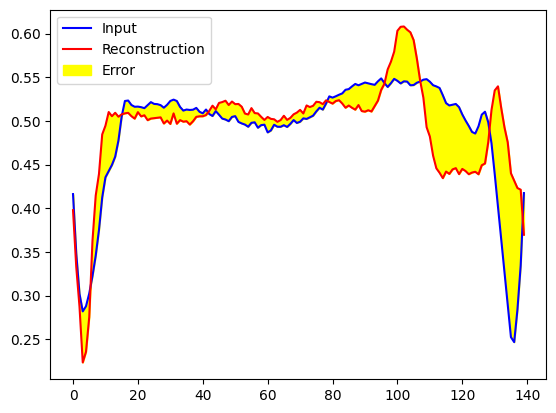

## ECG Anomaly Detection Using Autoencoders

### Introduction
This project aims to detect anomalies in electrocardiograms (ECGs) using an autoencoder. Autoencoder is trained as a type of unsupervised learning technique that learns to compress (encode) the input data and then reconstruct (decode) it back to the original input. The discrepancy between the original ECG and the reconstruction can signal an anomaly, which is useful for identifying potential heart abnormalities without manual inspection.

### Dataset
The dataset used is a `.csv` file of ECG readings, where each row corresponds to an ECG signal comprising 140 data points, and the last column indicates whether the ECG is normal (1) or anomalous (0).

### Preprocessing
The data is split into training, validation, and test sets with 60%, 20%, and 20% of the data respectively. The ECG data is normalized using a min-max scaler to scale the feature values to the range `[0, 1]`.

### Training
The Auto encoder model is compiled using the `nadam` optimizer and `mae` (Mean Absolute Error) as the loss function. It is trained solely on normal ECGs to learn the pattern of a typical ECG. Any deviations from this learned pattern should indicate an anomaly. The training is done for 100 epochs with a batch size of 512.

### Evaluation
After training, the model's reconstruction error is plotted against both the validation and the normal training ECGs to establish a threshold value for anomaly detection. ECGs with a reconstruction error above this threshold are considered anomalous. The threshold is set at `0.03` based on the observed reconstruction errors. The autoencoder's performance is then evaluated on the validation and test sets using metrics such as accuracy, precision, and recall.
#### Reconstruction of normal image
  

#### Reconstruction of anomalous image

### Results
The threshold for anomaly detection is fine-tuned using the validation set and the final model is tested to assess its performance on unseen data. The accuracy of the final model on the **validation set is reported as 96.7% and on test set it is 96.3%**, with corresponding precision and recall scores.

### Conclusion
This project demonstrates the application of autoencoders in the medical field, where they can be used to reliably identify abnormal patterns in ECG data, potentially aiding in the early detection of heart conditions.

#### Reference:  
[Handson Machine Learning](https://github.com/ageron/handson-ml3)
[https://www.kaggle.com/mineshjethva](https://www.kaggle.com/code/mineshjethva/ecg-anomaly-detection)
